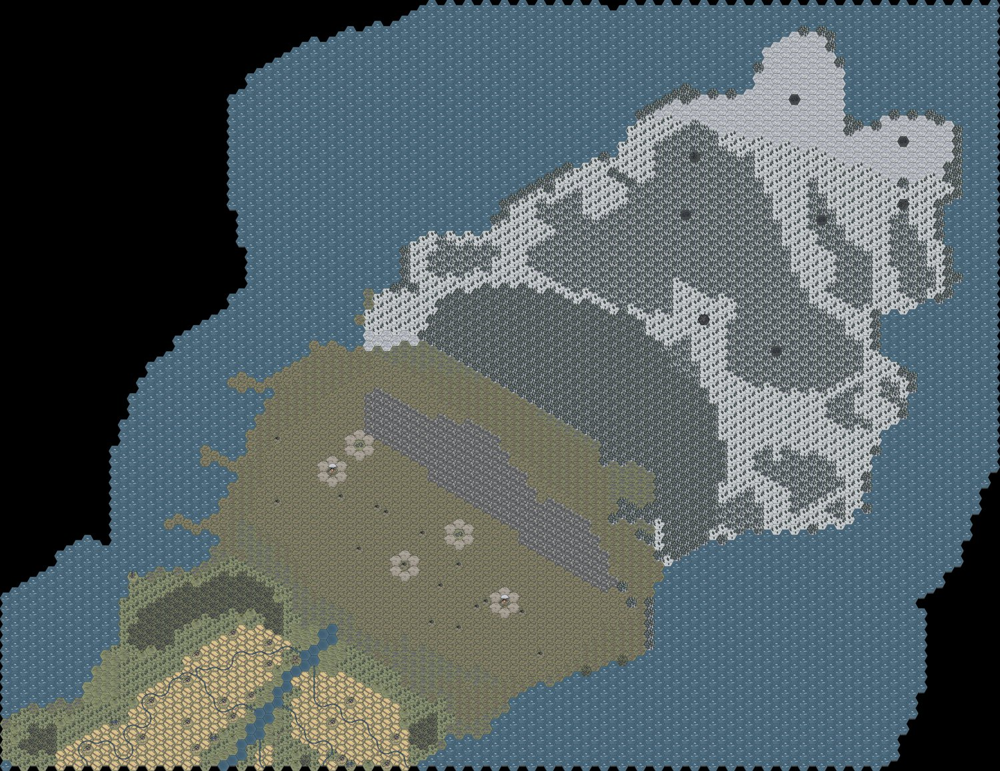
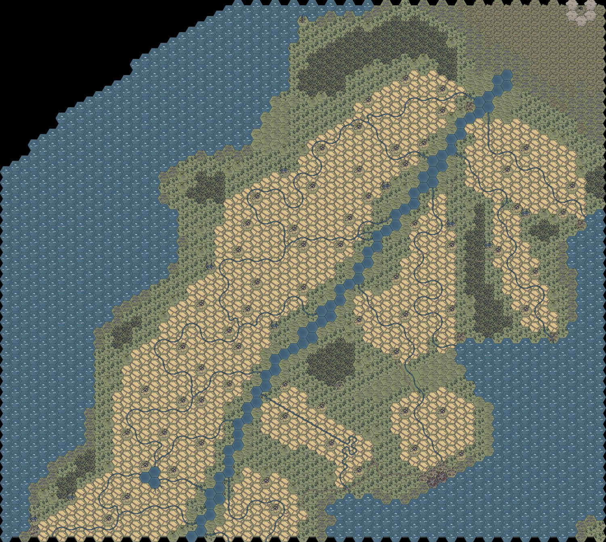
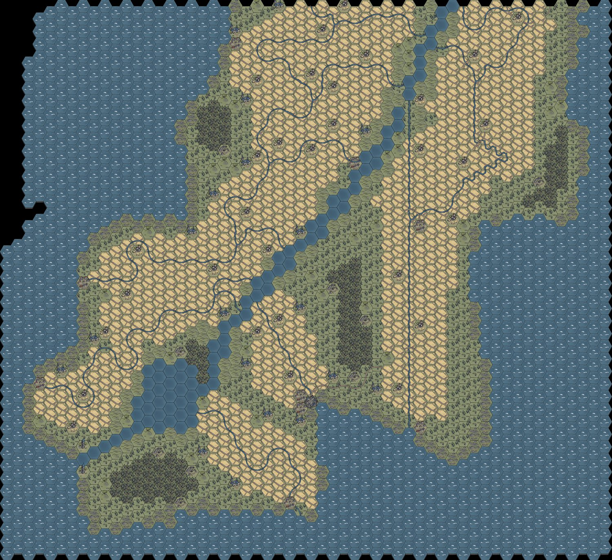
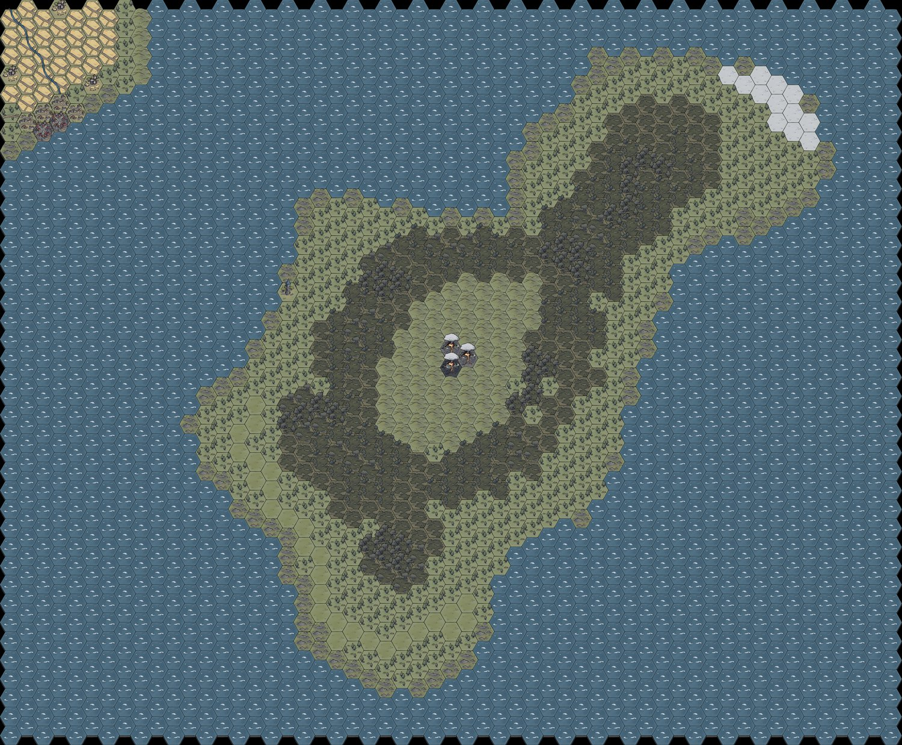

# Falldin hexmapper

A two-tool browser suite for building hex maps from the *World Map Hex Tiles* asset pack:
draw the map, and author reusable multi-hex **stamps** to speed it up.

## Examples

Regional maps of *Aska Island* built and HD-rendered with Falldin hexmapper:

| | |
|:---:|:---:|
|  |  |
| **North Aska** | **Middle Aska** |
|  |  |
| **South Aska** | **Shallowdeep** |

*(Shown at web resolution; the tool exports these at full print resolution — the originals are ~120 megapixels each.)*

The tool is compatible with Hex tile assets made by 2minutetabletop 

https://2minutetabletop.com/world-map-hex-tiles-assets/ 
This is the link for the assets. I highly recommend you use the patreaon assets for highest quality.

User notes : the mountain assets need adjustments still . Also any extra assets need to be loaded seperately. You choose which to use at any given moment .

Also the map

| File | What it is |
|---|---|
| `hex-editor.html` | **The map tool** — draw terrain, rivers, features; place stamps; export. |
| `stamp-creator.html` | **The stamp tool** — build custom hexes / multi-hex sets to reuse in the map tool. |
| `README.md` | This file. |

---

## Requirements

- **Google Chrome or Microsoft Edge.** (The folder picker + clipboard paste need a Chromium browser; Firefox/Safari won't load the tile folder.)
- The tile asset pack, e.g. `…\World+Map+Hex+Tiles+-+Patreon+Assets\`.
- No install, no internet. Just double-click an `.html` file.

---

## Quick start

1. Double-click **`hex-editor.html`**.
2. Click **📂 Load Tile Folder** and choose one DPI folder — **`Assets - 72 DPI (VTT)`** is recommended for editing (small & fast).
   - You can also point it at the whole pack root; duplicates across DPI folders are removed automatically and it keeps the 72 DPI copy.
   - The status bar reports what loaded, e.g. `753 tiles · 227 extras · 690 dupes skipped`.
3. Set **Columns / Rows** (a single 500 km map-square ≈ **30 × 26** at 12-mile hexes).
4. Pick a terrain tile from the palette and click/drag on the grid to paint.

That's the loop. Everything below is detail.

---

## The map tool (`hex-editor.html`)

### Tools (right panel)
- **✎ Paint** – lay the selected tile. Click or drag.
- **✕ Erase** – remove the top item of the active layer. (Right-click erases with any tool.)
- **◯ Fill Area** – draw a freehand loop; every hex inside fills with the selected tile.
- **⛶ Crop** – drag a box to select a region (shows its size in hexes). Feeds the export/render buttons.
- **❖ Stamp** – place a saved stamp (see Stamps below).
- **✋ Pan** – drag to move the view. (Also: middle-mouse drag, or hold **Space** and drag.)
- **✥ Recenter** – click a hex, then drag (or arrow-keys) to nudge an off-centre tile; double-click resets it.

### Layers
Each hex holds three layers, picked with the **Active Layer** buttons:
- **Terrain** – the base tile (one per hex; replaces).
- **River/Path** – stacks on top; supports rotation & auto-connect.
- **Feature** – towns, ruins, banners, etc.; stacks on top.

Picking a tile auto-selects the right layer (a river tile → River/Path, a town → Feature).

### Rivers & paths
- Rotate the piece before placing: **`R`** key, **scroll wheel** (while a river/path is active), or the **↺ / ↻** buttons — 60° steps give all six edge orientations from one asset.
- **Click a placed river again** to rotate it in place.
- **Auto-connect** (on by default): placing an unrotated river drops the matching piece on the neighbouring hex, so flow connects.

### Handy extras
- **Alt + click** = eyedropper (copy a hex's terrain onto your brush).
- **Randomize terrain variant** (on): painting Plains/Forest/etc. auto-varies so large areas don't look tiled.
- **Ctrl + Z** = undo (diff-based; cheap even on big maps).
- **Ruler** toggle shows column/row numbers.

### View & performance
- **Zoom**: on-screen `−  %  +` widget, **Ctrl + scroll** (zooms to cursor), or **`0`** to fit the whole map.
- Only on-screen hexes are drawn, and when zoomed far out it swaps to a fast colour overview — so large maps (100×100+) stay smooth.

### Template underlay
- **🗺 Template Image (or Ctrl+V)** — load or paste a reference map to trace over. Sliders control opacity / scale / offset; a checkbox draws it on top instead.

### Saving
- **💾 Save / Open** – project files (`.json`, dictionary-compressed).
- **Save States** panel – quick named saves kept *in the browser*, plus **auto-save** that offers to restore on reload.
- **🗑 Reset** – wipes the map (double-confirmed).

### Exporting & high-res render
- **🖼 Export PNG** – the whole map as a flat image (auto-scales down if huge).
- Crop panel:
  - **🖼 Export Selection PNG** – just the cropped region.
  - **🎨 Render Selection in HD** – the cropped region at **full asset resolution**. ⭐ *This is the best way to get a poster-quality regional map.*
  - **✂ Crop Map to Selection** – trim the working map down to the box.

**High-res workflow:**
1. Load the **HD tile folder** into the HD slot (**📂 Load HD Tile Folder** in the *Render (High-Res)* panel).
   - Use **`Assets - 300 DPI (Print)`** — note it's **WebP**, which the tool now accepts.
2. **⛶ Crop** a region.
3. **🎨 Render Selection in HD** → saves `falldin-region-hd.png`.
   A whole-map HD render must scale down to fit the browser; a *cropped* region usually renders at true full resolution.

---

## The stamp tool (`stamp-creator.html`)

A separate workspace for building **custom hexes** (a base + stuff on top) and **hex sets**
(several hexes arranged together) that you can drop as a unit in the map tool.

### Build
1. **📂 Add Folder / ＋ Add Files** – loads all hex tiles **plus every Extra** (towns, buildings, banners…). It loads *additively*, so you can stack multiple folders.
2. Paint on the small workspace grid using the same layers/tools as the map tool.

### Transform a hex — the **✥ Move / Size** tool
Click a hex, then:
- **drag** – move it (nudge off-centre)
- **scroll / slider** – **enlarge or shrink** it (40–500%) — great for oversized cities or mountains that overhang their hex
- **Hue shift** & **Saturation** sliders – recolour a tile (e.g. an autumn or cursed variant)
- **double-click** – reset position, size, hue & saturation

### Save
- **💾 Save to Library** – kept in the browser; appears automatically in the map tool's Stamps panel.
- **⭳ Export this Stamp** / **⭳ Export Library** – `.json` files you can back up or share.
- **⭱ Import** – load a stamp or a whole pack back in.
- Click any library thumbnail to reload it into the workspace for editing.

### Using stamps in the map tool
Open **hex-editor.html** → **Stamps** panel → **⟳ Reload** (if you just authored one) → click a stamp → click the map to place it. Or **⭱ Import file** a `.stamp.json`.

Stamps store **tile names**, not pixels — so a placed stamp becomes ordinary map cells and
**automatically renders at full resolution** in an HD render.

---

## Keyboard & mouse reference

| Action | Input |
|---|---|
| Paint / place | Left-click or drag |
| Erase | Right-click, or the ✕ tool |
| Eyedropper | **Alt** + click |
| Rotate river/path | **R** (Shift+R reverse) · scroll · click a placed river |
| Undo | **Ctrl + Z** |
| Pan | ✋ tool · middle-drag · **Space** + drag · scroll |
| Zoom | Ctrl + scroll (to cursor) · `−`/`+` · **`0`** = fit |
| Paste template | **Ctrl + V** |

---

## Scale cheat-sheet (for D&D)
Note that these measurements are from my own design. If you want you can downscale or upscale this to your own desires.

- **1 hex = 12 miles ≈ 19.3 km**; one 500 km map-square ≈ **30 columns × 26 rows**.
- Travel at Normal pace (24 mi/day) = **2 hexes/day**.

---

## Notes & caveats

- **Chromium only** — the folder picker is a Chrome/Edge feature.
- **Stamps live in the browser's local storage** for the folder you run the tools from; keep them together. Use **Export Library** for a real backup.
- **300 DPI is WebP.** Both loading and HD render handle it, but if an HD render says "tiles not found", (re)load the 300 DPI folder into the HD slot first.
- **Extended assets are kept** — they're different tiles, not duplicates. Only same-name copies across DPI folders (and a stray `Extras - Copy` folder) are de-duplicated.
- Everything runs locally; nothing is uploaded anywhere.
